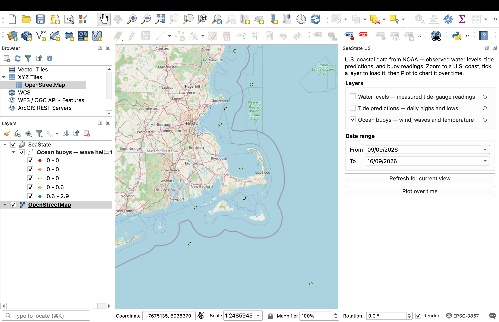
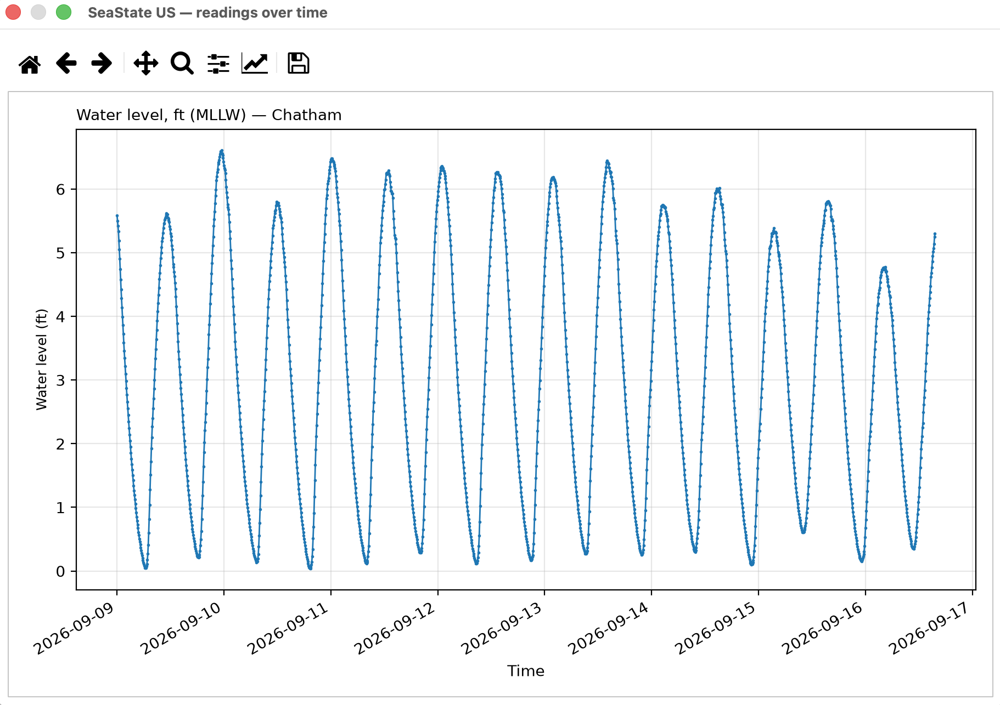

# SeaState US

A QGIS plugin that loads U.S. NOAA coastal data — tide-gauge water levels, tide
predictions, and offshore buoy readings — as point layers on the map, and charts
any of them as a time series.

Uses keyless public NOAA APIs — no account or token required.



Plotting a station's readings over time:



## What it loads

Three layer types, each fetched for the current map view and date range:

| Layer | What it is | Units | Source |
| --- | --- | --- | --- |
| **Water levels** | *Measured* water height at tide-gauge stations, every 6 minutes | feet (MLLW; IGLD on the Great Lakes) | NOAA CO-OPS |
| **Tide predictions** | *Predicted* daily high/low tides (not measured; coastal only) | feet, MLLW datum | NOAA CO-OPS |
| **Ocean buoys** | Offshore readings: wind, waves, air/water temperature, pressure | m, m/s, °C, hPa | NOAA NDBC |

Water levels are **observations**; predictions are an **astronomical
calculation** — different products, kept as separate layers. The NDBC live buoy
feed spans only the most recent ~45 days.

**Coverage:** U.S. coasts, the Great Lakes, and territories (Puerto Rico, Guam,
etc.). Coastal water levels use the MLLW tidal datum; Great Lakes use IGLD.
Because the Great Lakes have no astronomical tides, **tide predictions are
coastal-only**.

## Using it

1. Add a basemap (Browser → XYZ Tiles → OpenStreetMap) and zoom to a U.S. coast.
2. Open the panel: **Plugins → SeaState US → SeaState US**.
3. **Tick a layer** to load it for the current view and date range; untick to
   remove it. Use **Refresh for current view** after moving the map or changing
   dates.
4. **Plot over time** charts the loaded data.

### What gets plotted

Each loaded station or buoy becomes its **own chart**, stacked vertically in one
scrollable window (they share the time axis). The value on each chart is:

- Water-level and prediction layers → water height (ft).
- Buoy layers → wave height (m), falling back to wind speed or water temperature
  when a buoy reports no waves.

So loading three tide gauges gives three separate water-level charts; loading a
buoy adds a wave-height chart below them. Multiple buoy measurements are not
combined on one axis — one metric per chart keeps units honest.

## Install

Tested on **QGIS 4.2** (macOS). Matplotlib — bundled with QGIS 4.2 — is required
for the plot.

Copy or symlink the `seastate/` directory into your QGIS profile plugins folder.
On macOS:

```bash
ln -s /path/to/SeaState-US/seastate \
  "$HOME/Library/Application Support/QGIS/QGIS4/profiles/default/python/plugins/seastate"
```

Then enable **SeaState US** in Plugins → Manage and Install Plugins (tick "Show
also experimental plugins" in that dialog's Settings tab).

## Data sources

| Source | Feed | Auth |
| --- | --- | --- |
| CO-OPS tides & water levels | `api.tidesandcurrents.noaa.gov` (data + metadata APIs) | none |
| NDBC buoys | `ndbc.noaa.gov` active-stations XML + `realtime2` text | none |

NOAA's 6-minute water-level product is capped at 31 days per request; longer
ranges are fetched in chunks automatically.

## Limitations

- A very large request (wide view × long date range × several layers) can take a
  while. Fetching runs in the background so QGIS stays responsive, but the data
  will simply appear once each fetch completes.
- No CSV export (QGIS already exports any layer: right-click → Export → Save
  Features As → CSV).

## Layout

```
seastate/
  metadata.txt          QGIS plugin metadata
  __init__.py           classFactory entry point
  seastate_plugin.py    plugin class + dock panel + load/plot logic
  layers.py             builds the QGIS point layers
  plot.py               Matplotlib time-series charts
  clients/
    coops.py            NOAA CO-OPS client
    ndbc.py             NOAA NDBC client
tests/
  console_test.py       run inside the QGIS Python Console
```

## License

GPL-2.0-or-later.
